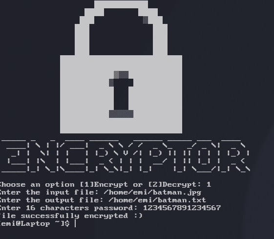

### Encryptor and Decryptor
this was a little proyect to learn a little of Cryptopp 
to use the program you need to compile it and then open a terminal and put ./encryptor <entry_file> <output_file> <a_16_characters_key>
maybe i Will updates it or maybe no

### other
-----------------
This program was created with the help of Claude Code for the extraction function, since I wanted to learn how to use Crypto++ but never did; furthermore, I know nothing about cryptography, so I have no idea how secure it is.
